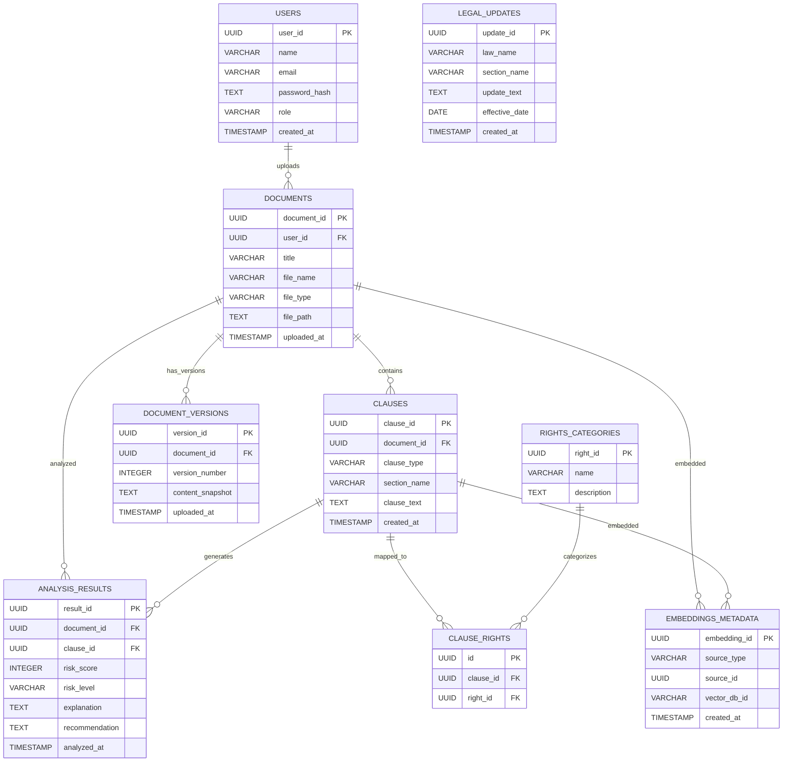

# Contract Guardian ER Diagram

```mermaid
erDiagram

    USERS ||--o{ DOCUMENTS : uploads

    DOCUMENTS ||--o{ CLAUSES : contains
    DOCUMENTS ||--o{ DOCUMENT_VERSIONS : has_versions
    DOCUMENTS ||--o{ ANALYSIS_RESULTS : analyzed

    CLAUSES ||--o{ ANALYSIS_RESULTS : generates
    CLAUSES ||--o{ CLAUSE_RIGHTS : mapped_to

    RIGHTS_CATEGORIES ||--o{ CLAUSE_RIGHTS : categorizes

    DOCUMENTS ||--o{ EMBEDDINGS_METADATA : embedded
    CLAUSES ||--o{ EMBEDDINGS_METADATA : embedded

    USERS {
        UUID user_id PK
        VARCHAR name
        VARCHAR email
        TEXT password_hash
        VARCHAR role
        TIMESTAMP created_at
    }

    DOCUMENTS {
        UUID document_id PK
        UUID user_id FK
        VARCHAR title
        VARCHAR file_name
        VARCHAR file_type
        TEXT file_path
        TIMESTAMP uploaded_at
    }

    CLAUSES {
        UUID clause_id PK
        UUID document_id FK
        VARCHAR clause_type
        VARCHAR section_name
        TEXT clause_text
        TIMESTAMP created_at
    }

    DOCUMENT_VERSIONS {
        UUID version_id PK
        UUID document_id FK
        INTEGER version_number
        TEXT content_snapshot
        TIMESTAMP uploaded_at
    }

    ANALYSIS_RESULTS {
        UUID result_id PK
        UUID document_id FK
        UUID clause_id FK
        INTEGER risk_score
        VARCHAR risk_level
        TEXT explanation
        TEXT recommendation
        TIMESTAMP analyzed_at
    }

    LEGAL_UPDATES {
        UUID update_id PK
        VARCHAR law_name
        VARCHAR section_name
        TEXT update_text
        DATE effective_date
        TIMESTAMP created_at
    }

    RIGHTS_CATEGORIES {
        UUID right_id PK
        VARCHAR name
        TEXT description
    }

    CLAUSE_RIGHTS {
        UUID id PK
        UUID clause_id FK
        UUID right_id FK
    }

    EMBEDDINGS_METADATA {
        UUID embedding_id PK
        VARCHAR source_type
        UUID source_id
        VARCHAR vector_db_id
        TIMESTAMP created_at
    }
```
